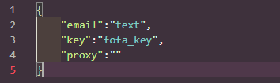
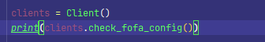

# 调用方法

## 配置文件

配置文件位于根目录下的`config.json`



其中，email填写您的Fofa注册email，key填写fofa的api-key。

proxy默认为空，如需代理，可对其进行填写。

## 检查Fofa配置



```python
clients = Client()
print(clients.check_fofa_config())
```

只需要按照上述方法配置，即可检查配置信息。会在控制台输出你当前的`email`、`key`和`proxy`。

当然，每次执行前都会自动执行一次get_userinfo()，会根据您在config.json中填写的email和key进行获取信息。